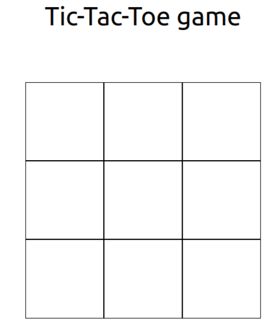
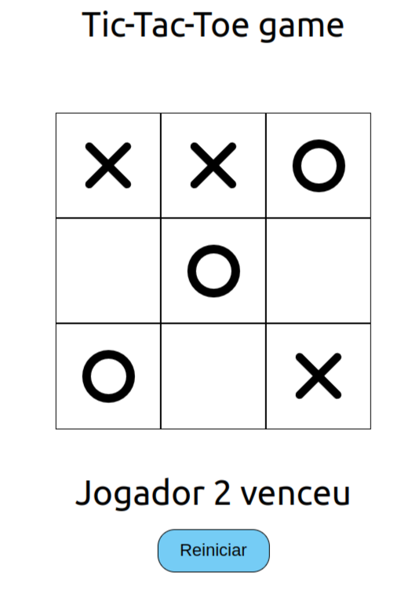
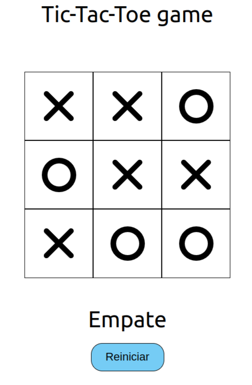

 
<h1 align="center">The simple tic-tac-toe game</h1>

## Table of Contents

- [About the Project](#about-the-project)
  - [Built With](#built-with)
- [Run This App](#run-this-app)
- [Acknowledgements](#acknowledgements)
- [Contact](#contact)

## About The Project

Play tic-tac-toe in your browser.

### Built With
- React
- GitHub

## Run This App

- Clone or Download
- Extract the project if you Download
- Go to the folder with your terminal
- Run npm install
- Run npm start

## Acknowledgements

- [React](https://reactjs.org/)

## Show your support

Give a ⭐️ if you like this project!

## Contact
Felipe Enne Mendes Ribeiro
* Email - felipeenne@gmail.com
* <a href="https://www.linkedin.com/in/felipe-enne/" target="_blank">LinkedIn</a>
* <a href="https://felipeenne.com/" target="_blank">Portfolio</a>
